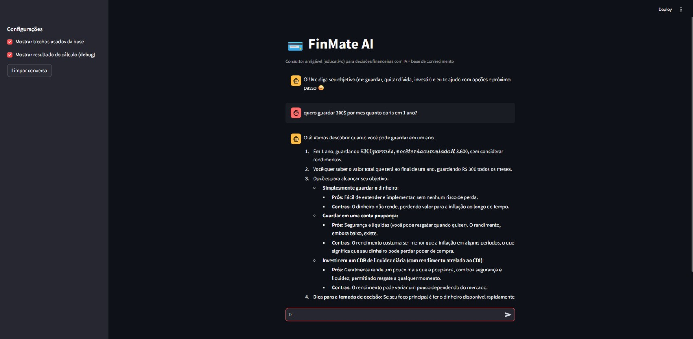

<p align="center">
  
</p>

<h1 align="center" style="font-size: 3.2em; margin-top: 10px;">
  FinMate AI
</h1>


<p align="center">
Experiência digital de relacionamento financeiro (educativa) guiada por IA generativa (Gemini) + boas práticas de UX.
</p>
> ⚠️ Aviso: conteúdo educativo. Não substitui aconselhamento financeiro profissional.

---

## O que é
O **FinnMate AI** é um assistente conversacional que:
- entende perguntas em linguagem natural
- responde com base em uma **base de conhecimento** (Markdown)
- realiza **simulações demonstrativas** (Python)
- mantém **contexto** da conversa (Streamlit)
- entrega orientação com **dica de decisão** + **próximo passo**

---

## Arquitetura 
- `app.py`: UI + memória + orquestração
- `src/retrieval.py`: busca simples (keyword scoring)
- `src/tooling.py`: detecção de intenção
- `src/calculos.py`: cálculos testáveis
- `src/agent.py`: prompt + Gemini

---

## Stack
- Python
- Streamlit
- Gemini (Google GenAI)
- Markdown KB

---

## ▶️ Como rodar localmente

### 1) Instale dependências
```bash
python -m venv .venv
# Windows (PowerShell):
.venv\Scripts\Activate.ps1
pip install -r requirements.txt

```
---

## Demo


<p align="center">
  <em>Pergunta de exemplo: “Quero guardar R$ 300 por mês. Quanto terei em 1 ano?</em>
</p>